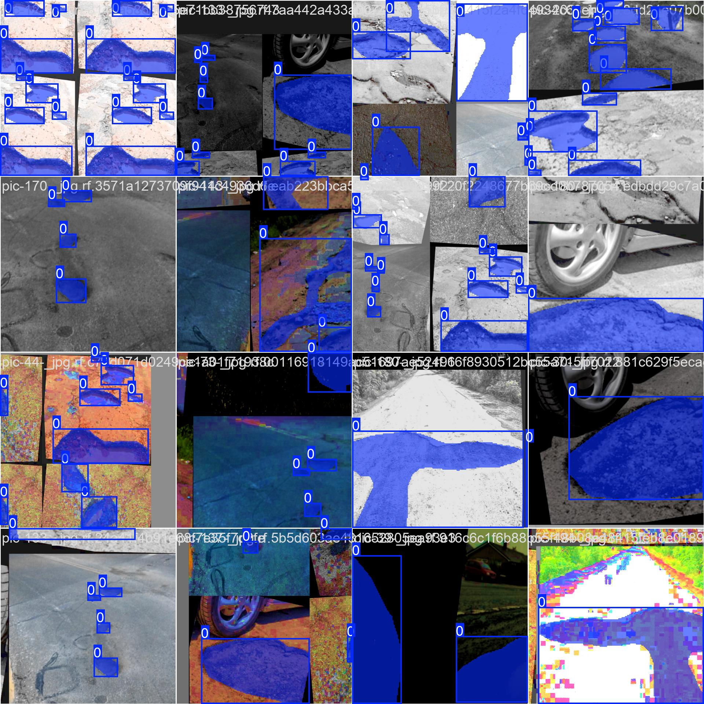

### CNN（卷積神經網路）

-   主要用途：適用於圖像分類，例如識別圖片中是否有貓或狗（多類分類）。
-   問題：CNN 本質上擅長分類，但無法直接找出圖像中的具體物體位置。
-   簡單解決方案：可以把圖像切割成很多小塊（網格）並分別分類，但這樣的計算成本很高。

### R-CNN（Region-based CNN）

-   解決 CNN 不能做目標檢測的問題。
-   步驟：

    1. 使用 Selective Search 找到感興趣區域（Region Proposals）（大約 2000 個）。
    2. 將這些區域分別送入 CNN 進行特徵提取（例如使用 AlexNet）。
    3. 使用 SVM 來分類這些區域內的物體。
    4. 使用線性回歸來調整邊界框座標。

-   缺點：
    -   需要對每張圖片的 2000 個區域分別做 CNN 計算，速度非常慢（每張圖片約 47 秒）。
    -   不能即時處理。

### Fast R-CNN

-   改進 R-CNN，使其更快：

    1. 將整張圖片送入 CNN，生成特徵圖（Feature Map），而不是對每個區域分開送入 CNN。
    2. 在特徵圖上用 Region Proposal Network（RPN）來找出可能的區域，然後分類。
    3. 使用 ROI Pooling 加速區域處理，並用 Softmax 來分類。

-   改進點：
    -   只做一次 CNN 計算，而不是對 2000 個區域分開做 CNN。
    -   比 R-CNN 快很多，但仍然使用 Selective Search（速度還不夠快）。

### Faster R-CNN

-   進一步改進 Fast R-CNN，使其更快，完全消除 Selective Search。
-   關鍵點：

    1. 用 RPN（Region Proposal Network）取代 Selective Search，讓神經網路自己學習如何產生候選區域。
    2. CNN 提取特徵後，RPN 直接從特徵圖上找區域，然後做分類和邊界框回歸。
    3. 卷積運算只做一次，提高效率。

-   改進點：
    -   大幅提升運行速度，可以接近即時（real-time）。
    -   仍然只輸出「邊界框」，不能做到像素級別的分割。

### Mask R-CNN

-   解決 Faster R-CNN 只能產生邊界框，無法做像素級物件分割的問題。
-   關鍵點：

    1. 在 Faster R-CNN 的基礎上，增加了一個分割分支，用於輸出像素級的遮罩（mask）。
    2. 使用 ROI Align 技術，能夠更精確對齊目標區域，提高精度。
    3. 骨幹網路使用 ResNet101，提高性能。

-   改進點：

    -   能夠實現像素級別的物體分割（Instance Segmentation）。
    -   比 Faster R-CNN 更強大，但計算成本更高。

-   總結對比

| 模型         | 區域提取方式                    | 速度             | 是否可即時 | 能否做到像素級分割 |
| ------------ | ------------------------------- | ---------------- | ---------- | ------------------ |
| R-CNN        | Selective Search                | 慢               | 否         | 否                 |
| Fast R-CNN   | Selective Search + CNN 特徵提取 | 快               | 否         | 否                 |
| Faster R-CNN | RPN + CNN                       | 更快             | 接近即時   | 否                 |
| Mask R-CNN   | RPN + CNN + Mask 分割           | 最快（計算量大） | 否         | 是                 |

## YOLOv8

### YOLO

-   YOLO 是一種用於物體檢測的深度學習模型，由 Joseph Redmon、Santosh Divvala、Ross Girshick 和 Ali Farhadi 提出。它的主要特點是可以在單次前向傳播（look once）中同時完成目標分類與定位，因此比傳統的方法更快。
-   YOLO 受到歡迎的原因是它在保持高準確度的同時，模型規模相對較小。早期版本（YOLO v1 到 v4）是基於 C 語言開發的，使用 Darknet 深度學習框架。
-   近年來，YOLOR、YOLOX、YOLOv6 和 YOLOv7 等基於 PyTorch 的變體相繼出現，它們採用了最新的技術來提高模型的準確性和效率。

### YOLOV8

-   YOLOv8 是 YOLO 系列的最新版本，於 2023 年 1 月 10 日發布。它引入了一些架構上的改進，使模型的準確度更高，並且對訓練時間進行了優化。
-   YOLOv8 可以用於目標檢測（Object Detection）、圖像分類（Image Classification）和實例分割（Instance Segmentation）。它改善了訓練時間過長的問題，使得準確度與訓練時間之間的平衡更優化。

### YOLOv8 的關鍵特性

-   YOLOv8 的擴展性很強，它被設計為一個框架，支援所有先前版本的 YOLO，這樣可以更容易地在不同版本之間切換並比較它們的性能。
-   它包含了一個新的骨幹網路（Backbone Network）、新的無錨點檢測頭（Anchor-free Detection Head）以及新的損失函數（Loss Function）。
-   YOLOv8 的高效率使其可以在不同的硬體平台（如 CPU 和 GPU）上運行，並且無錨點（Anchor-free）檢測方式比以往版本更快、更準確。

### 為什麼選擇 YOLOv8

-   YOLOv8 在 COCO 和 Roboflow 數據集上的測試表現良好，這兩個數據集是目標檢測領域常用的基準。
-   與其他 YOLO 版本相比，YOLOv8 在速度和準確度方面有更好的表現，平均精度（Mean Average Precision, mAP）達到了 53.7。
-   YOLOv8 也是第一個提供官方安裝包的 YOLO 版本，使用者可以直接透過 pip 安裝，這使得部署變得更加方便。

## 建立 YOLOv8 環境

```
conda create -n yolo8-env python=3.9 -y
conda activate yolo8-env

# Windows + Pip + Python + CUDA 11.8
pip3 install torch torchvision torchaudio --index-url https://download.pytorch.org/whl/cu118


# 透過 Ultralytics 官方 pip 套件，安裝官方提供的 ultralytics 套件
pip install ultralytics

# 安裝完成後，執行以下指令來確認是否安裝成功
yolo --help
```

-   [測試環境](./Test_Pytorch_Env.ipynb)

### [yolo8 測試(照片、影片、webCam)](./YOLO8%20test/YOLOv8_Test.ipynb)

<span>
  
  
</span>


### 基於 YOLO8 路面坑挖檢測(Potholes Detection)

-   [Potholes_Detection + 自己用 roboflow 標註訓練](./Potholes%20Detection/Potholes_Detection_自己用roboflow標註訓練.ipynb)
-   [Potholes_Detection + kaggle 別人做好的資料集去做訓練](./Potholes%20Detection/Potholes_Detection_別人做好標籤.ipynb)

#### 訓練結果




#### 模型使用

<span>
    
    
</span>

#### 評分結果


#### 混淆矩陣

<span>
    
    
</span>
